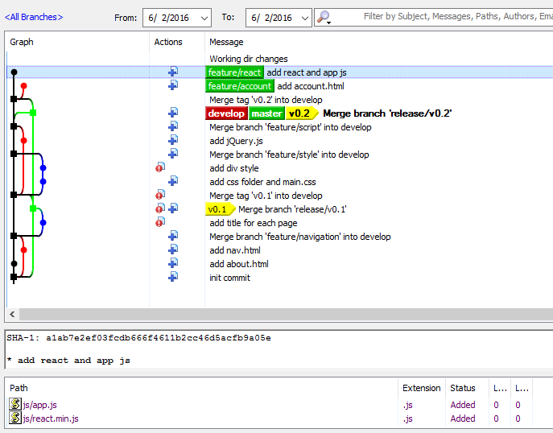

1 准备工作

1.1 创建空白目录
```bash
mkdir HelloGitflow
cd HelloGitflow
```

1.2 开始当前目录工作，示例创建和保存一个 index.html

```html
<!DOCTYPE html>

<html lang="en" xmlns="http://www.w3.org/1999/xhtml">
<head>
    <meta charset="utf-8" />
    <title></title>
</head>
<body>
    <div></div>
</body>
</html>
```

```bash
git add index.html
git commit -m "init commit"

```

2 Git flow init

```bash
git flow init
```

这里使用了默认配置，一路 next


3 一个完整的开发周期

3.1 任务拆解，开始添加分支 about 和 navigation

```bash
git flow feature start about
git flow feature start navigation
```


3.2.1 about 分支创建了一个 about.html

```bash
git checkout feature/about
# more work to do
git add about.html
git commit -m "add about.html"
```


3.2.2 navigation 分支创建了一个 nav.html

```bash
git checkout feature/navigation
# more work to do
git add nav.html
git commit -m "add nav.html"
```


3.3 开始合并分支

3.3.1 合并 about

```bash
git flow feature finish about
```


3.3.2 合并 navigation，存在 merge 过程

```bash
git flow feature finish navigation
```


3.4 版本发布

3.4.1 当 feature 积累数量达到可以进行版本发布时，开始进行 release 发布

```bash
git flow release start v0.1
```


3.4.2 部分内容需要修改，在这里为各页面添加了 title

```bash
git add index.html about.html nav.html
git commit -m "add title for each page"
```


3.4.3 结束当前 release 分支

```bash
# git push 
git flow release finish v0.1
```


4 连续的开发周期

我们开始在远程分支上工作，可以在结束分支前先将其 push 到远程分支上避免未在本地保留的情况

```bash
git remote add github https://github.com/jusfr/HelloGitflow.git
git push github --all
```


虽然开出来很多分支，但是可以观察到 master 和合并了两次，且分别被标记为 v0.1 和 v0.2


不考虑测试等情况，标记 v0.1 和 v0.2 的 master 版本或者 release/v0.1 和 release/v0.2 都是可以部署的版本。

5 线上的 bug 修复

现在已经在 v0.2 基础上进行 account 和 react 的分支开发，但是发现线上的 v0.2 版本需要立即修复的问题，分支状态



开启 hotfix/v0.2.1 来修复这个问题

```bash
 git flow hotfix start v0.2.1
 ```
 
 在 hotfix/v0.2.1 的视角来看，它是从最近的 mater 分支checkout 下来的，所以对正在进行的 account 和 react 无影响
 
 
 
 以全局视角来看，hotfix/v0.2.1 与 account 和 react 确实没有交集
 
 
 
 现在问题修复，合并 hotfix/v0.2.1
 
 ```bash
 git flow hotfix finish 'v0.2.1'
 ```
 
当然仍然可以先 push 到远程分支，可以看到进行了若干步操作

1. 合并 hotfix/v0.2.1 到 master 分支，master 分支被打上 v0.2.1 的 tag 
2. 合并 master 到 develop 分支。

在第2步中，如果 develop 有过变更，比如有过 feature 合并，那么可能存在冲突需要解决  
 
 
 
 在此示例中， master 分别被打上了 v0.1, v0.2, v0.2.1 标记，这对基于 master 的持续部署非常友好：可以快速在这些版本中部署与回滚，而不用关心存在多少变更与分支等等。